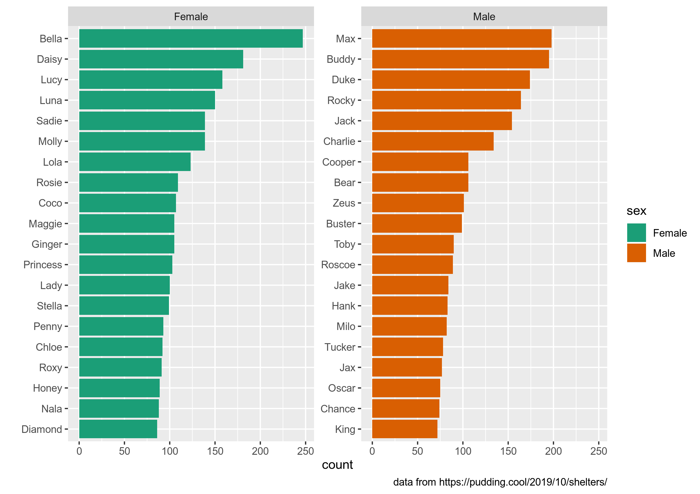
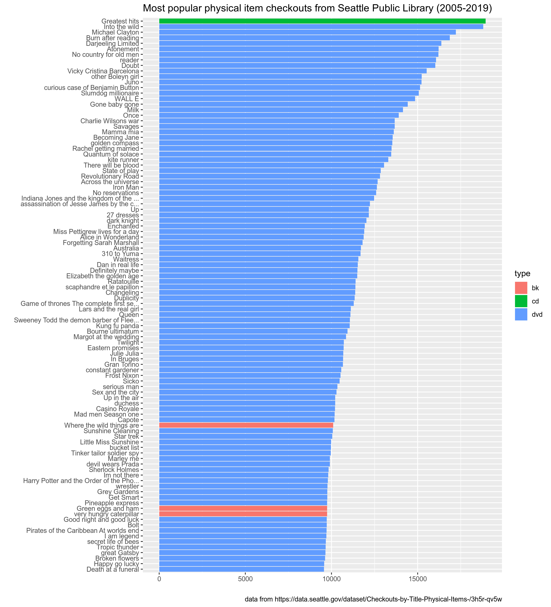

```{r, message=FALSE, include=FALSE}
library(tidyverse)
library("readxl")
knitr::opts_chunk$set(message = FALSE, fig.asp = 1, fig.width = 10, out.width = '100%')
```

## Задание 1.1

На Pudding вышла [статья "Finding Forever Homes"](https://pudding.cool/2019/10/shelters/), посвященная миграции и эмиграции собак в США. В вашем репозитории лежит немного обработанный датасет `dog_names.csv`, которые использовался в статье. Датасет состоит из 58 113 строк и 5 переменных:

* `id` -- уникальный  id с сервиса PetFinder
* `name` -- кличка собаки
* `sex` -- пол собаки (`Female`, `Male`, or `Unknown`)
* `age` -- категориальная переменная с возрастом собаки (`Baby`, `Young`, `Adult`, `Senior`)
* `contact_state` -- штат, в котором находиться приют

Заполните пропуски ниже, так чтобы получился следующий график. На нем изображено по 20 самых популярных кличек собак живущих в приютах в США для каждого пола. Обратите внимание на подписи осей. Нестанадртные цвета на этом графике появились благодаря команде `scale_fill_brewer(palette="Dark2")`.


setwd('Users/apple/Documents/UNIVERSITY/R/homework')

```{r}
dog_names <- read_csv("dog_names.csv")
dog_names %>% 
  count(sex, name, sort = TRUE) %>% 
  group_by(sex) %>% 
  filter(n() > 10) %>%
  slice(1:20) %>% 
  mutate(name = fct_reorder(name, n)) %>% 
  ggplot(aes(n, name, fill = sex))+
  geom_col()+
  labs(x = "count",
       y = ' ',
       caption = "data from https://pudding.cool/2019/10/shelters/")+
  facet_wrap(~sex, scales = "free")+
  scale_fill_brewer(palette="Dark2")
```

## Задание 1.2

Используя датасет из предыдущего задания, заполните пропуски, так чтобы получившаяся программа считала, какую долю составляют собаки разного возраста в подгруппах по полу. Должно получиться что-то такое:

```
# A tibble: 4 x 3
  age      Male Female
  <chr>   <dbl>  <dbl>
1 Adult  0.476  ...
2 Young  ...    ...
3 Baby   ...    ...
4 Senior ...    ...
```

На всякий случай: доли в каждом из столбцов должны давать в сумме 1 (при округлении), если у Вас выходит значительно больше -- значит что-то Вы делаете не так, как ожидается. Постарайтесь, чтобы ответ получался в одну цепочку пайпов.

```{r}
dog_names %>%
  mutate(numb = as.double(table(sex)[sex])) %>% 
  group_by(age, sex) %>% 
  filter(sex == "Male" | sex == "Female") %>%
  mutate(count = n()) %>%
  summarise(proportion = count/numb) %>%
  distinct() %>%
  pivot_wider(names_from = "sex",
              values_from = "proportion")
```

## Задание 1.3

В датасете `seattle_public_library_checkouts.xlsx` содержаться информация об объектах, выданных библиотекой Сиэтла 100 и более раз (исходные данные доступны [здесь](https://data.seattle.gov/dataset/Checkouts-by-Title-Physical-Items-/3h5r-qv5w)). Датасет состоит из разбитых на листы файла `.xlsx` 180 495 строк и  5 переменных:

* `id` -- идентификационный номер объекта
* `type` -- тип объекта (`bk` -- книга, `bknh` -- другая категория с книгами, `cas` -- кассеты, `cd` -- CD, `dvd` -- DVD, `kit` -- комплект (я сам пока не разобрался что там...), `vhs` -- видеокассеты VHS)
* `name` -- название
* `n` -- сколько раз взяли в том или иному году
* `year` -- год

Используя датасет, заполните пропуски ниже, так чтобы получившаяся программа нарисовала следующий график. На графике изображены 100 самых популярных объектов за все годы.


  
```{r}
d2005 <- read_excel("seattle_public_library_checkouts.xlsx")
d2006 = read_excel("seattle_public_library_checkouts.xlsx", 2)
d2007 = read_excel("seattle_public_library_checkouts.xlsx", 3)
d2008 = read_excel("seattle_public_library_checkouts.xlsx", 4)
d2009 = read_excel("seattle_public_library_checkouts.xlsx", 5)
d2010 = read_excel("seattle_public_library_checkouts.xlsx", 6)
d2011 = read_excel("seattle_public_library_checkouts.xlsx", 7)
d2012 = read_excel("seattle_public_library_checkouts.xlsx", 8)
d2013 = read_excel("seattle_public_library_checkouts.xlsx", 9)
d2014 = read_excel("seattle_public_library_checkouts.xlsx", 10)
d2015 = read_excel("seattle_public_library_checkouts.xlsx", 11)
d2016 = read_excel("seattle_public_library_checkouts.xlsx", 12)
d2017 = read_excel("seattle_public_library_checkouts.xlsx", 13)
d2018 = read_excel("seattle_public_library_checkouts.xlsx", 14)
d2019 = read_excel("seattle_public_library_checkouts.xlsx", 15)


d2005 %>% 
  bind_rows(d2006, d2007, d2008, d2009, d2010, d2011, d2012, d2013, d2014, d2015, d2016, d2017, d2018, d2019) %>%
  group_by(name,type) %>%
  mutate(count = sum(n)) %>%
  select(type,name,count) %>% 
  distinct() %>%
  arrange(desc(count)) %>%
  ungroup()%>%
  slice(1:100) %>%
  ggplot(aes(fct_reorder(name, count), count, fill = type))+
  geom_col()+
  coord_flip()+
  labs(x = " ",
       title = "Most popular physical item checkouts from Seattle Public Library (2005-2019)",
       y = ' ',
       caption = "data from https://data.seattle.gov/dataset/Checkouts-by-Title-Physical-Items-/3h5r-qv5w")+
  theme(axis.text.y = element_text(size = 7, margin = margin(t = 12, r = 5, b = 12, l = 0)))
```

